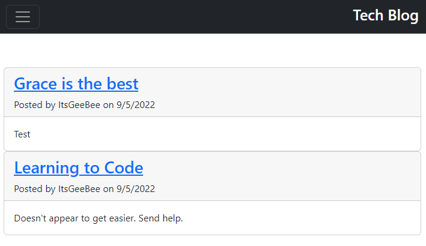

# MVC - Tech Blog

### CMS-style blog site

## Technologies Used 

- Node.js/Express.js to create a RESTful API
- MySQL Database with Sequelize ORM for the database
- Handlebars.js as the template engine
- Javascript and Bootstrap framework for the styling and interaction between elements of the front-end 
- npm packages such as bcrypt, connect-session-sequelize, dotenv, express-session
- Heroku for application hosting

## Description

User is able to sign up and make blog posts. These posts can be edited from the dahsboard. 

Comments can be submitted which include time stamp and user name. 

## Usage and Installation

Installation of npm packages required are invoked with the following command:

`npm i`

The application server will be invoked with the following command:

`node server.js`

## Link to deployed Heroku Application
[Click here](https://secure-sea-84765.herokuapp.com/)

## Screenshot

